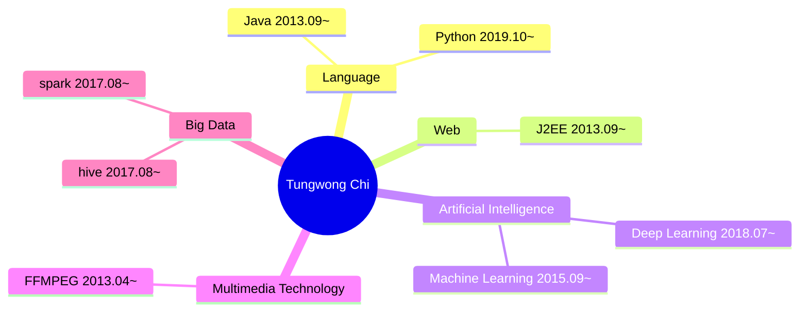

# Self Introduction

Posted on 2024-03-16 by Tungwong Chi

## Introduction



## Appendix

### How to Cite This Article

To reference this article, please use the following formats:

```bibtex
@online{引用标识,
    title={Tungwong Chi Self Introduction},
    author={Tungwong Chi},
    year={2024},
    month={03},
    url={\url{https://tungwongchi.github.io/introduction.html}},
}
```

---

&copy; 2020 Tungwong Chi. All rights reserved.
